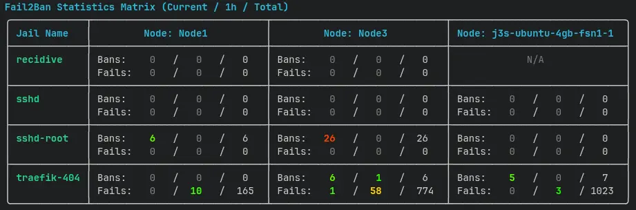

# Fail2Ban Terminal Monitor

This script connects to a Prometheus server, retrieves Fail2Ban metrics, and displays them in a terminal dashboard using the Rich library. It provides a quick overview of the current state of Fail2Ban.

I created it to use it as a desktop widget using with the [Dank Material Shell](https://danklinux.com/).

## Features

- display the current number of bans and fails
- multi instance support
- color-coded output based on thresholds

## Usage

Just set the required environment variables in a `.env` file and run the script:

```bash
PROMETHEUS_URL=http://localhost:9090
PROMETHEUS_USER=your_username
PROMETHEUS_PASSWORD=your_password # Optional but required if PROMETHEUS_USER is set
```
